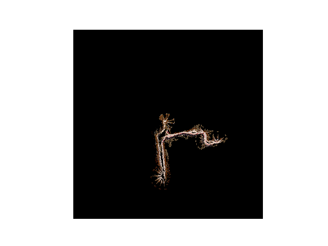
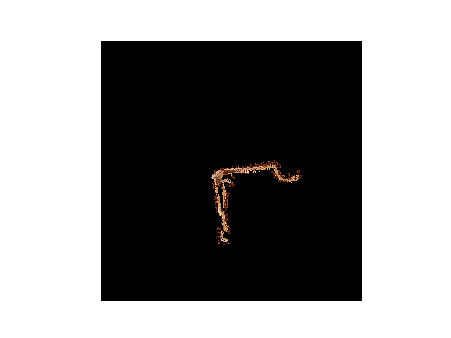

# Simultaneous Localization and Mapping (SLAM) based on Particle Filter

This project implements Simultaneous Localization and Mapping (SLAM) using odometry, inertial, 2-D laser range, and RGBD measurements from a differential-drive robot, shown below, based on particle filter.


## Requirements

The following are packages that I used:

* `numpy` >= 1.16.1  

* `imageio` >= 2.5.0  

* `matplotlib` >= 3.0.2  

```
pip3 install -r requirements.txt
```

## Testing Environment

* sysname: `Linux`  

* release: `4.15.0-45-generic`  

* machine: `x86_64`  

* python: `3.6.7` and `3.7.1`

## Results

The following are the results of different data set. 
* Note: The blue trajectory is the initial trajectory and the red one is the updated trajectory after SLAM algorithm. 
* Note: Texture map is sampled every 20 time stamps.

### Training Data 1

|            Trajectory             |      SLAM Progress      |          Texture Map           |
| :-------------------------------: | :---------------------: | :----------------------------: |
|  |  |  |

### Training Data 2

|            Trajectory             |      SLAM Progress      |          Texture Map           |
| :-------------------------------: | :---------------------: | :----------------------------: |
|  |  |  |

### Testing Data

|            Trajectory             |      SLAM Progress      |
| :-------------------------------: | :---------------------: |
|  |  |

